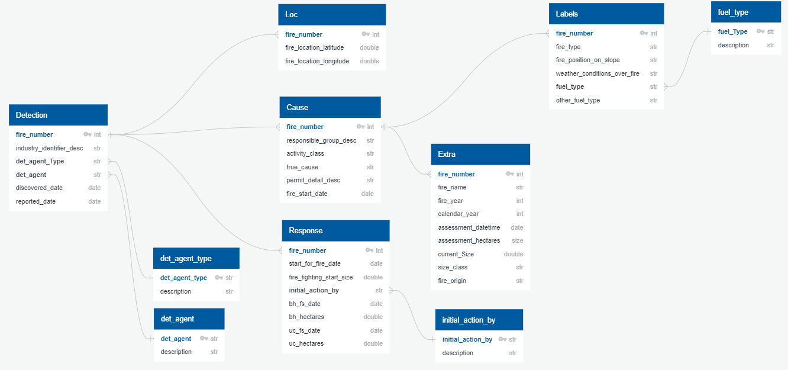

# Final_Project - Predicting Forest Fires

## Reason for our topic:
The reason for our choice of Predicting Forest Fires was due to many cases of forest fires occurring that show up in the news, specifically in the Alberta province. We came to an agreement on this topic by utilizing the online collabortive service called Miro to research different topics, what data is available for those topics and ultimately vote on a topic that we all mutually agreed to be the best topic to work with, which concluded in us choosing to predict forest fires in Alberta. 

## Description of source of data:
The data that we managed to research and ultimately decided to use is one from Wildfire Alberta. They have a total of 4 datasets on wildfires ranging all the way from 1961 to the latest file recorded in 2018. The file that we opted to use is from 2006 to 2018 with 19845 rows and 39 columns. The dataset includes crucial information such as fire size, the date it was detected, location of the fire, origin, as well as other information such as fire type, weather conditions over fire, fuel type, and more. 

## Questions to answer:
- can we predict the size of the next fire?
- to what level of accuracy can we predict the size of fire?

# Provisional Mock Machine Learning Model

## Machine Learning Model: 
Based on the data, the mock machine learning model is looking at predicting the change from the starting fire size and the discovered fire size by the number of days it took for the fire to grow. Essentially in the real world, we would like to find out if there is a relationship between the number of days that have passed from the start of the fire to when it was discovered with the growth of the fire size before it has been classified as being under control. Wild fires have been increasingly devastating in many countries over the years. If we could build an accurate model, this could potentially provide a crucial time period of when a fire could be under control. 

## Reason for Model Choice
As the data used for the features and output contains continous data, Linear Regression has been chosen to test the sample data.

## Project Planning

### Data and ERD
Datasource: 
- https://wildfire.alberta.ca/resources/historical-data/historical-wildfire-database.aspx

ERD:

Description:
- The raw data contained a number of feature columns.
- In order to organize the data and help the data transformation process, columns were grouped by their features and split into the following seperate tables.
    - Detection: contains all data on how the fires were determined
    - Cause: contains most data on the cause of each fire
    - Loc: contains the location coordinates of each fire
    - Reponse: contains all data on the fire management response
    - Labels: contains categorical information of each fire
    - Extra: contains features that were deemed less useful for analytical purposes
    - Others: various dictionary tables were linked to elaborate on 3 letter-codes

## Communication Protocol
The way that our team has agreed to communicate is by utilizing Slack as the base of our communication (ex. need any immediate help, quick question, clarification on a topic, conduct a quick virtual call, etc.). We also agreed to conduct virtual meetings on designated days and times in order to ensure everyone is on the same page, and everyone remains on the same page. 
